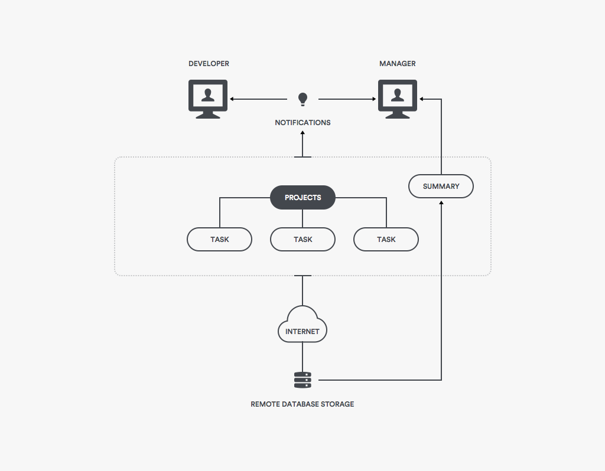

# Design Document for TM 

## Introduction

Our Time Management application "TM" is created mainly for developers and managers of small teams to help them track time more efficiently to increase productivity. Clients in a commercial setting will find that actively managing time to reduce the amount of wasted resources will increase revenue for that company; however, this product is not just for commercial uses. Clients in a non-commercial setting will still find this application useful: it will help anyone and their team stay focused on whatever project they are working on.

## Product Reviews

We have looked into two applications for research purposes: Timely and GetHarvest. 
The **Timely** application is a simple application that helps track time, profit, and efficiency. It is easy to use and implements a modern user unterface. Timely is built with obsession with time in mind and promises users to find the "25th hour", meaning that it would deliver increased time efficiency to the user. A very neat feature Timely offers is a stopwatch that a user can click to start logging time, it doesn't get more user-friendly than that. Timely also have implemented an idea of time as budget for each project, which gave us the idea of adding budget to TM.
**GetHarvest** started out with a simple focus on time tracking in 2006, Harvest has grown considerably over the last decade and now encompasses invoicing and project management. Even after expanding into the invoicing world, the software is still focused on time and team management and has over 50,000 users. It is easy to use and provides deeper integration than Timely. Some of the features also include downloadable Summary spreadheets and future project time estimation.

**Ideas of ours influenced by Timely:**
* Beautiful Spreadsheets
* A budget variable instead of size
* Organizing tasks through multiple projects

**Ideas of ours influenced by GetHarvest:**
* Easy to use pause buttons
* Spreadsheets that show time

## Project Overview

TM is a Time Management GUI application, that will help teams track time spent on projects with the purpose of increasing efficiency of a team or a single developer who would like to maximize his/her time to increase profits. TM is a desktop application.

When users open up TM, they are greeted with a log in/create account graphical user interface. After logging in the application will either take them to a dashboard for developers or a dashboard for managers. Each type of user has their own uses from this point.

## Project Architecture

We will be implementing a two-tier client/server architecture for the TM project. with the user interface located in the user’s desktop environment, and all storage needs are met with the use of a remote database.

**Client side:** will be implemented with the use of Java8 and a choice of GUI library between Swing or JavaFX.

**Server side:** MySQL for implementing a simple DBMS, which will store the information such as login data and summaries.

## Requirements
| Requirement name | Requirement description                                                                                 |
|------------------|---------------------------------------------------------------------------------------------------------|
|   REQ1           |  The program shall create and keep a record of the time a task was started when commanded by the user   |
|   REQ2           |  The program shall create and keep a record of the time a task was stopped when commanded by the user   |
|   REQ3           |  The program shall find the time elapsed between the time a task was started and stopped                |
|   REQ4           |  The program shall describe what a task is about with a description given by the user                   |
|   REQ5           |  Users shall be able to view a summary of the tasks created by them, and be able to create and download a clean spreadsheet of the summary data    |
|   REQ6           |   Developers shall be able to easily pause a task that is currently running                             |
|   REQ7           |  Managers shall be able to set notes on tasks developers are working on                                 |
|   REQ8           | Both managers and developers shall be able to set a time budget for each task                           |             
|   REQ9           | Managers shall be able to set a due date for a task                                                     |
|   REQ10          | Managers shall be able to assign a task to a particular developer                                       |
|   REQ11          | The program shall notify the user of the upcoming due date or budget limit                              |
|   REQ12          | Each task shall be categorized under a project, thus to organize the workflow                           |
|   REQ13          | A user shall be able to log on as a manager or developer, allowing different functions                  |
|   REQ14          | A user shall be able to create an account with their own username, password, and user type (manager or developer) |
|   REQ15          | A user shall be able to change the password associated with their username                              |
|   REQ16          | Users shall be able to delete tasks and projects                                                        |

## Use cases

| Use case ***UC-1***             | Name: Start task                                   |
|---------------------------|----------------------------------------------------|
| Related requirements      | REQ1                                               |
| Initiating actor          | Developer                                          |
| Actor's goal              | To start a task at the current time                |
| Participating actors      | System, File Writer                                |
| Preconditions             | The task is named                                  |
| Postconditions            | The time when the task was started is now stored   |

#### Flow of events for main success scenario:

| Number |    Description                                                                       |
|--------|--------------------------------------------------------------------------------------|
| 1  ->  | **Developer** names the task to be started                                           |
| 2  ->  | **Developer** then selects the option "Start Task"                                   |
| 3  <-  | **System** signals that there is a task name, and the "Start Task" option was chosen |
| 4  <-  | **File Writer** then writes the time to a file                                       |

&nbsp;
&nbsp;
&nbsp;

| Use case ***UC-2***             | Name: Stop task                                    |
|---------------------------|----------------------------------------------------|
| Related requirements      | REQ2                                               |
| Initiating actor          | Developer                                          |
| Actor's goal              | To stop a task at the current time                 |
| Participating actors      | System, File Writer                                |
| Preconditions             | The task is named. The task has started            |
| Postconditions            | The time when the task was stopped is now stored   |

#### Flow of events for main success scenario:

| Number |    Description                                                                      |
|--------|-------------------------------------------------------------------------------------|
| 1  ->  | **Developer** names the task to be stopped                                          |
| 2  ->  | **Developer** then selects the option "Stop Task"                                   |
| 3  <-  | **System** signals that there is a task name, and the "Stop Task" option was chosen |
| 4  <-  | **File Writer** then writes the time to a file                                      |

&nbsp;
&nbsp;
&nbsp;

| Use case ***UC-3***             | Name:   Summarize                                                                              |
|---------------------------|------------------------------------------------------------------------------------------------|
| Related requirements      | REQ2, REQ3**, REQ5                                                                             |
| Initiating actor          | User                                                                                           |
| Actor's goal              | To get printable summary on projects/tasks                                                     |
| Participating actors      | System, FileWriter                                                                             |
| Preconditions             | The Project(s)/task(s) have a name. The task(s) have started but not necessarily stopped       |
| Postconditions            | Named projects, subtasks, due dates, summarized data and statistics are written to downloadable file      

#### Flow of events for main success scenario:

| Number |    Description                                                                             |
|--------|--------------------------------------------------------------------------------------------|
| 1 ->   | **User** selects option to "Summarize"                                                     |
| 2 <-   | **System** gathers all summarized data as it relates to a particular manager or developer  |
| 3 <-   | **FileWriter** writes summarized data to downloadable file                                 |

&nbsp;
&nbsp;
&nbsp;

| Use case ***UC-4***             | Name: Describe task                     |
|---------------------------|-----------------------------------------|
| Related requirements      | REQ4                                    |
| Initiating actor          | Developer                               |
| Actor's goal              | To add a description to a named task    |
| Participating actors      | System, File Writer                     |
| Preconditions             | The task is named. The task has started |
| Postconditions            | The description provided is now stored  |

#### Flow of events for main success scenario:

| Number |    Description                                                                                  |
|--------|-------------------------------------------------------------------------------------------------|
| 1  ->  | **Developer** names the task to be described                                                    |
| 2  ->  | **Developer** then selects the option "Describe Task"                                           |
| 3  ->  |  **Developer** enters a description for named task                                              |
| 4  <-  | **System** signals that there is a task name, and the "Describe Task" option was chosen         |
| 5  <-  | **File Writer** then writes either a new description to file or appends to existing description |   

&nbsp;
&nbsp;
&nbsp;
 
| Use case ***UC-5***             | Name: Log in                                                  |
|---------------------------|---------------------------------------------------------------|
| Related requirements      | REQ 13, REQ 14, REQ 15                                        |
| Initiating actor          | User                                                          |
| Actor's goal              | To log into their account to be able to use the application   |
| Participating actors      | System, Username Checker, Password Checker                    |
| Preconditions             | Username exist in the system files                            |
| Postconditions            | User is logged in with approriate functions avaliable         |

#### Flow of events for main succes scenario:

|Number| Description                                                             |
|------|-------------------------------------------------------------------------|
| 1 -> | **User** enters their username and password                             |
| 2 -> | **User** hits the log in button                                         |
| 3 <- | **System** verifies the information                                     |
| 4 <- | **System** displays the apporiate user interface (manager or developer) |

&nbsp;
&nbsp;
&nbsp;

| Use case ***UC-6***             | Name: Pause Task                                            |
|---------------------------|-------------------------------------------------------------|
| Related requirements      | REQ6                                                        |
| Initiating actor          | Developer                                                   |
| Actor's goal              | To start a task at the current time                         |
| Participating actors      | System, File Writer                                         |
| Preconditions             | The task is named. The task has started, and has not stopped|
| Postconditions            | The task is paused                                          |

#### Flow of events for main success scenario:

| Number |    Description                                                                       |
|--------|--------------------------------------------------------------------------------------|
| 1  ->  | **Developer** names the task to be paused                                            |
| 2  ->  | **Developer** then selects the option "Pause Task"                                   |
| 3  <-  | **System** signals that there is a task name, and the "Pause Task" option was chosen |
| 4  <-  | **File Writer** then writes the time paused to a file                                |

&nbsp;
&nbsp;
&nbsp;

| Use case ***UC-7***             | Name: Unpause Task                                           |
|---------------------------|--------------------------------------------------------------|
| Related requirements      | REQ6                                                         |
| Initiating actor          | Developer                                                    |
| Actor's goal              | To start a task at the current time                          |
| Participating actors      | System, File Writer                                          |
| Preconditions             | The task is named. The task has started, and has not stopped |
| Postconditions            | The task is unpaused                                         |

#### Flow of events for main success scenario:

| Number |    Description                                                                         |
|--------|----------------------------------------------------------------------------------------|
| 1  ->  | **Developer** names the task to be unpaused                                            |
| 2  ->  | **Developer** then selects the option "Unpause Task"                                   |
| 3  <-  | **System** signals that there is a task name, and the "Unpause Task" option was chosen |
| 4  <-  | **File Writer** then writes the time that the task is unpaused to a file               |

&nbsp;
&nbsp;
&nbsp;

| Use case ***UC-8***             | Name: Set Notes                                                           |
|---------------------------|---------------------------------------------------------------------------|
| Related requirements      | REQ7                                                                      |
| Initiating actor          | Manager                                                                   |
| Actor's goal              | Set notes on a task developer(s) are working on                           |
| Participating actors      | System, File Writer                                                       |
| Preconditions             | The task is named. The task has started, and a developer has been assigned|
| Postconditions            | Notes are added to the task. The developer is notified of these notes.    |

#### Flow of events for main success scenario:

| Number |    Description                                                                   |
|--------|----------------------------------------------------------------------------------|
| 1  ->  | **Manager** names the task to set notes on                                       |
| 2  ->  | **Manager** then selects the option "Comment"                                    |
| 3  <-  | **System** signals that there is a task name, and the "Comment" option was chosen|
| 4  <-  | **File Writer** then writes the the task name and the notes to a file            |

&nbsp;
&nbsp;
&nbsp;

| Use case ***UC-9***                | Name: Due Date                                                         |
|------------------------------|------------------------------------------------------------------------|
| Related requirements         | REQ 9                                                                  |
| Initiating actor             | Manager                                                                |
| Actor's goal                 | A due date is made for a particular task                               |
| Participating actors         | System, File Writer                                                    |
| Preconditions                | Task is already created                                                |
| Postconditions               | A task has been given a due date                                       |

#### Flow of events for main success scenario:

| Number |    Description                                                                       |
|--------|--------------------------------------------------------------------------------------|
| 1  ->  | **Manager** picks a task to create a due date for                                    |
| 2  ->  | **Manager** then selects the option "Due Date"                                       |
| 3  <-  | **System** signals that there is a task name, and the "Due Date" option was chosen   |
| 4  <-  | **File Writer** then writes the task name and the given due date                     |

&nbsp;
&nbsp;
&nbsp;

| Use case ***UC-10***               | Name: Notifications                                                      |
|------------------------------|--------------------------------------------------------------------------|
| Related requirements         | REQ 11                                                                   |
| Initiating actor             | Developer                                                                |
| Actor's goal                 | To have a reminder for the user of upcoming due dates or budget limits   |
| Participating actors         | System, File Writer                                                      |
| Preconditions                | Task is already created                                                  |
| Postconditions               | User has been notified                                                   |

#### Flow of events for main success scenario:

| Number |    Description                                                                   |
|--------|----------------------------------------------------------------------------------|
| 1  ->  | **Developer** sets a time for user to be notified                                |
| 2  <-  | **System** signals that the timer is done                                        |
| 3  <-  | **File Writer** then displays the upcoming dates                                 |

&nbsp;
&nbsp;
&nbsp;

| Use case ***UC-11***               | Name: Budget                                                           |
|------------------------------|------------------------------------------------------------------------|
| Related requirements         | REQ 8                                                                  |
| Initiating actor             | User                                                                   |
| Actor's goal                 | Set time budget for a task                                             |
| Participating actors         | System, File Writer                                                    |
| Preconditions                | Task is already created                                                |
| Postconditions               | A budget is set up                                                     |

#### Flow of events for main success scenario:

| Number |    Description                                                                       |
|--------|--------------------------------------------------------------------------------------|
| 1  ->  | **User** picks a task to create a budget for                                         |
| 2  ->  | **User** then selects the option "Budget"                                            |
| 3  ->  | **User** then enters the amount for the budge                                        |
| 4  <-  | **System** signals that there is a task name, and the "Budget" option was chosen     |
| 5  <-  | **File Writer** then writes the task name and the given budget                       |

&nbsp;
&nbsp;
&nbsp;

| Use case ***UC-12***               | Name: Create Account                                                   |
|------------------------------|------------------------------------------------------------------------|
| Related requirements         | REQ 14                                                                 |
| Initiating actor             | User                                                                   |
| Actor's goal                 | Create an account with their log in credentials                        |
| Participating actors         | System, File Writer                                                    |
| Preconditions                | Account is not already created                                         |
| Postconditions               | Account with username/password combination is created                  |

#### Flow of events for main success scenario:

| Number |    Description                                                                       |
|--------|--------------------------------------------------------------------------------------|
| 1  ->  | **User** enters in a username and password                                           |
| 2  ->  | **User** selects a user type (manager or developer)                                  |
| 3  <-  | **System** verifies that the username does not already exist                         |
| 4  <-  | **File Writer** writes the username and its associated password and user type        |

&nbsp;
&nbsp;
&nbsp;

| Use case ***UC-13***               | Name: Changing Password                                                |
|------------------------------|------------------------------------------------------------------------|
| Related requirements         | REQ 15                                                                 |
| Initiating actor             | User                                                                   |
| Actor's goal                 | Change password associated with a specific username                    |
| Participating actors         | System, File Writer                                                    |
| Preconditions                | Account with specific username exists                                  |
| Postconditions               | Account's password is updated                                          |

#### Flow of events for main success scenario:

| Number |    Description                                                                       |
|--------|--------------------------------------------------------------------------------------|
| 1  ->  | **User** enters in a username                                                        |
| 2  <-  | **System** verifies that the username exist                                            |
| 3  ->  | **User** enters a password                                                           |
| 4  <-  | **File Writer** writes the new password associated to the user name                  |

&nbsp;
&nbsp;
&nbsp;

| Use case  ***UC-14***            | Name: Assign Task                                                      |
|------------------------------|------------------------------------------------------------------------|
| Related requirements         | REQ 10                                                                 |
| Initiating actor             | Manager                                                                |
| Actor's goal                 | Assign a task to a specific developer                                  |
| Participating actors         | System, File Writer                                                    |
| Preconditions                | Task is already created, there are existing developers                 |
| Postconditions               | Task is associated with a developer                                    |

#### Flow of events for main success scenario:

| Number |    Description                                                                       |
|--------|--------------------------------------------------------------------------------------|
| 1  ->  | **Manager** Selects a task and a developer                                           |
| 2  <-  | **System** verifies that the task and the developer exist                              |
| 3  <-  | **File Writer** writes the associated developer to the task                          |

&nbsp;
&nbsp;
&nbsp;

| Use case  ***UC-15***            | Name: Assign Project                                                   |
|------------------------------|------------------------------------------------------------------------|
| Related requirements         | REQ 12                                                                 |
| Initiating actor             | User                                                                   |
| Actor's goal                 | Assign Task to be associated with a project                            |
| Participating actors         | System, File Writer                                                    |
| Preconditions                | Task is already created, a project is already created                  |
| Postconditions               | Task is associated with the project specified                          |

#### Flow of events for main success scenario:

| Number |    Description                                                                       |
|--------|--------------------------------------------------------------------------------------|
| 1  ->  | **User** enters a task name and project name.                                        |
| 2  <-  | **System** verifies that the task exist.                                             |
| 3  <-  | **File Writer** writes the associated project name to the task.                      |

&nbsp;
&nbsp;
&nbsp;

| Use case  ***UC-16***            | Name: Create Project                                                   |
|------------------------------|------------------------------------------------------------------------|
| Related requirements         | REQ 12                                                                 |
| Initiating actor             | User                                                                   |
| Actor's goal                 | Create a project to subdivide tasks                                    |
| Participating actors         | System, File Writer                                                    |
| Preconditions                | A project with the chosen name is not already created.                 |
| Postconditions               | A project with the chosen name is now created.                         |

#### Flow of events for main success scenario:

| Number |    Description                                                                       |
|--------|--------------------------------------------------------------------------------------|
| 1  ->  | **User** enters a name.                                                              |
| 2  ->  | **User** Selects "Create Project".                                                   |
| 3  <-  | **System** verifies that the project under that name does not already exist.         |
| 4  <-  | **File Writer** creates the project under that project name.                         |

| Use case  ***UC-17***            | Name: Delete Project                                                   |
|------------------------------|------------------------------------------------------------------------|
| Related requirements         | REQ 16                                                                 |
| Initiating actor             | User                                                                   |
| Actor's goal                 | Delete a project to clean up space                                     |
| Participating actors         | System, File Writer                                                    |
| Preconditions                | A project with the chosen name is already created.                     |
| Postconditions               | A project with the chosen name is now deleted.  All Tasks associated with that project are no longer associated with that project.                       |

#### Flow of events for main success scenario:

| Number |    Description                                                                       |
|--------|--------------------------------------------------------------------------------------|
| 1  ->  | **User** enters a name.                                                              |
| 2  ->  | **User** Selects "Delete Project".                                                   |
| 3  <-  | **System** verifies that the project under that name exists.                         |
| 4  <-  |  **File Writer** unassigns tasks to that project name                                |
| 5  <-  |  **File Writer** removes the project under that project name.                        |

| Use case  ***UC-18***            | Name: Delete Task                                                   |
|------------------------------|------------------------------------------------------------------------|
| Related requirements         | REQ 16                                                                 |
| Initiating actor             | User                                                                   |
| Actor's goal                 | Delete a task to clean up space                                        |
| Participating actors         | System, File Writer                                                    |
| Preconditions                | A task with the chosen name is already created.                        |
| Postconditions               | A task with the chosen name is now deleted.                           |

#### Flow of events for main success scenario:

| Number |    Description                                                                       |
|--------|--------------------------------------------------------------------------------------|
| 1  ->  | **User** enters a name.                                                              |
| 2  ->  | **User** Selects "Delete Task".                                                      |
| 3  <-  | **System** verifies that the task under that name exists.                            |
| 4  <-  | **File Writer** removes the task under that name.                                    |

## Traceability Matrix
| REQ | PW | UC1| UC2| UC3 |UC4 |UC5 |UC6 |UC7 |UC8 |UC9|UC10|UC11|UC12|UC13|UC14|UC15|UC16|UC17|UC18 |
|-----|----|----|----|----|----|----|----|----|----|----|----|----|----|----|----|----|----|----|----|
|REQ1 |    | x |  |  |   |   |   |   |   |   |   |   |   |   |   |   |   |   |   |   |  |
|REQ2 |    |   | x | x |   |   |   |   |   |   |   |   |   |   |   |   |   |   |   |   |  |
|REQ3 |    |   |  | x  |   |   |   |   |   |   |   |   |   |   |   |   |   |   |   |   |  |
|REQ4 |    |   |  |  | x |   |   |   |   |   |   |   |   |   |   |   |   |   |   |   |  |
|REQ5 |    |  |  | x |   |   |   |   |   |   |   |   |   |   |   |   |   |   |   |   |  |
|REQ6 |    |   |  |  |   |   | x | x |   |   |   |   |   |   |   |   |   |   |   |   |  |
|REQ7 |    |   |  |  |   |   |   |   | x |   |   |   |   |   |   |   |   |   |   |   |  |
|REQ8 |    |   |  |  |   |   |   |   |   |   |   | x |   |   |   |   |   |   |   |   |  |
|REQ9 |    |   |  |  |   |   |   |   |   | x |   |   |   |   |   |   |   |   |   |   |  |
|REQ10 |    |   |  |  |   |   |   |   |   |   |   |   |   |   | x |   |   |   |   |   |  |
|REQ11 |    |   |  |  |   |   |   |   |   |   | x |   |   |   |   |   |   |   |   |   |  |
|REQ12 |    |   |  |  |   |   |   |   |   |   |   |   |   |   |   |  x| x |   |   |   |  |
|REQ13 |    |   |  |  |   | x |   |   |   |   |   |   |   |   |   |   |   |   |   |   |  |
|REQ14 |    |   |  |  |   | x |   |   |   |   |   |   | x |   |   |   |   |   |   |   |  |
|REQ15 |    |   |  |  |   | x |   |   |   |   |   |   |   |  x|   |   |   |   |   |   |  |
|REQ16 |    |   |  |  |   |   |   |   |   |   |   |   |   |   |   |   |   | x | x |   |  |
|Max PW     |   |  |  |   |   |   |   |   |   |   |   |   |   |   |   |   |   |   |   |  |
|Total PW   |   |  |  |   |   |   |   |   |   |   |   |   |   |   |   |   |   |   |   |  |

## Domain Model 
| Responsibility Description | Type | Concept Name |
|----------------------------|------|--------------|
| Rs1:                           | D/K     | Testing              |
