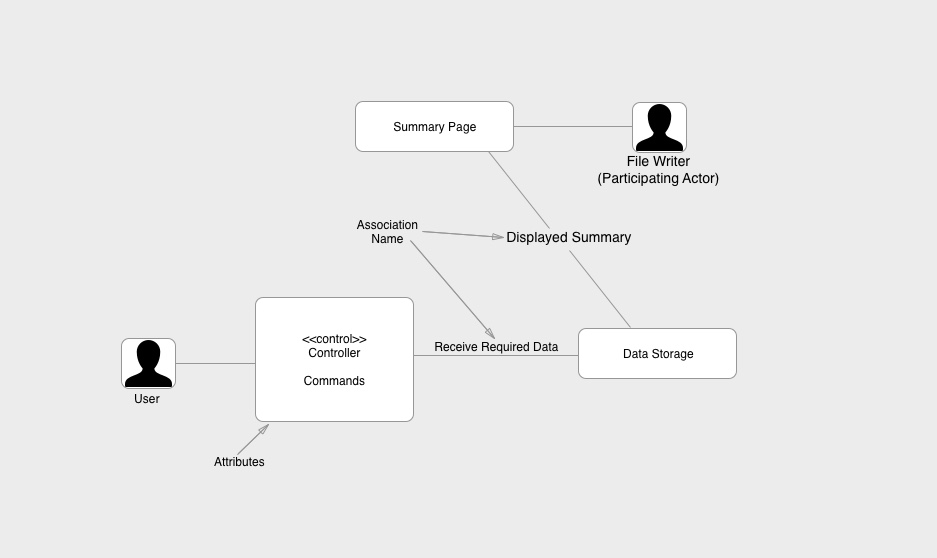
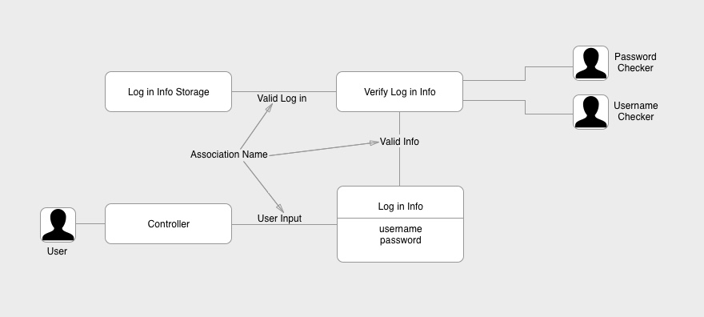
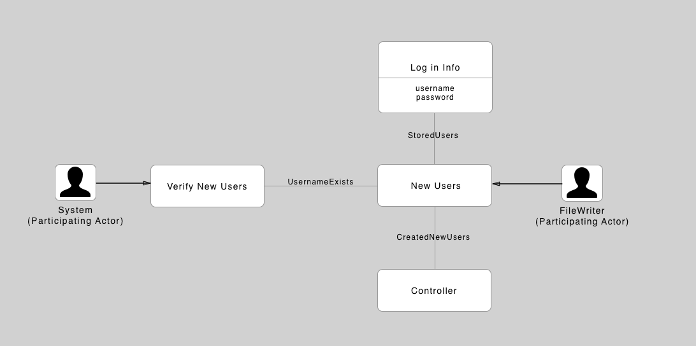
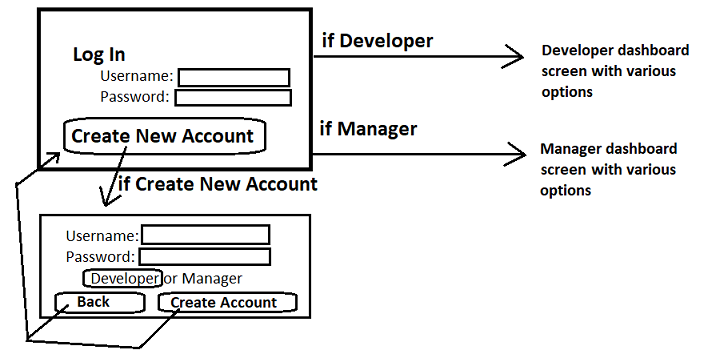
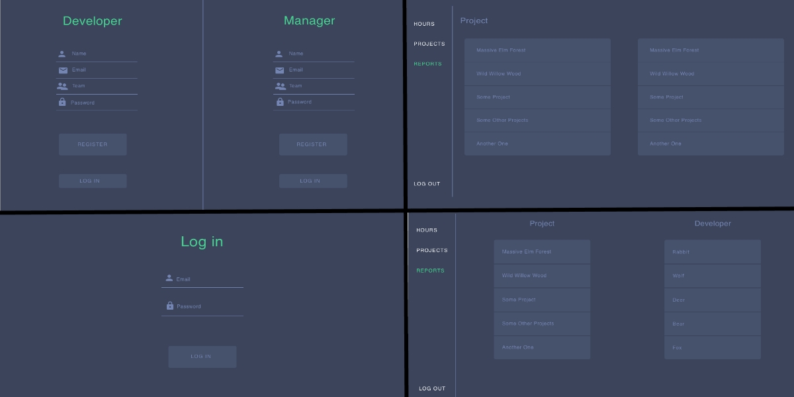

# Design Document for TM 

## Introduction

Our Time Management application "TM" is created mainly for developers and managers of small teams to help them track time more efficiently to increase productivity. Clients in a commercial setting will find that actively managing time will increase revenue for that company; however, this product is not just for commercial uses. Clients in a non-commercial setting will find this application useful.

## Product Reviews

We have looked into two applications for research purposes: Timely and GetHarvest. 
The **Timely** application is a simple application that helps track time, profit, and efficiency. It is easy to use and implements a modern user unterface. Timely is built with obsession with time in mind and promises users to find the "25th hour", meaning that it would deliver increased time efficiency to the user. A very neat feature Timely offers is a stopwatch that a user can click to start logging time, it doesn't get more user-friendly than that. Timely also have implemented an idea of time as budget for each project, which gave us the idea of adding budget to TM.
**GetHarvest** started out with a simple focus on time tracking in 2006, Harvest has grown considerably over the last decade and now encompasses invoicing and project management. Even after expanding into the invoicing world, the software is still focused on time and team management and has over 50,000 users. It is easy to use and provides deeper integration than Timely. Some of the features also include downloadable Summary spreadheets and future project time estimation.

**Ideas of ours influenced by Timely:**
* Beautiful Spreadsheets
* A budget variable instead of size
* Organizing tasks through multiple projects

**Ideas of ours influenced by GetHarvest:**
* Easy to use pause buttons
* Spreadsheets that show time

## Project Overview

TM is a Time Management GUI application, that will help teams track time spent on projects with the purpose of increasing efficiency of a team or a single developer who would like to maximize his/her time to increase profits. TM is a desktop application.

When users open up TM, they are greeted with a log in/create account graphical user interface. After logging in the application will either take them to a dashboard for developers or a dashboard for managers. Each type of user has their own uses from this point.

## Project Architecture

We will be implementing a two-tier client/server architecture for the TM project. with the user interface located in the user’s desktop environment, and all storage needs are met with the use of a remote database.

**Client side:** will be implemented with the use of Java8 and a choice of GUI library between Swing or JavaFX.

**Server side:** MySQL for implementing a simple DBMS, which will store the information such as login data and summaries.

## Requirements
| Requirement name | Requirement description                                                                                 |
|------------------|---------------------------------------------------------------------------------------------------------|
|   REQ1           |  The program shall create and keep a record of the time a task was started when commanded by the user   |
|   REQ2           |  The program shall create and keep a record of the time a task was stopped when commanded by the user   |
|   REQ3           |  The program shall find the time elapsed between the time a task was started and stopped                |
|   REQ4           |  The program shall describe what a task is about with a description given by the user                   |
|   REQ5           |  Users shall be able to view a summary of the tasks created by them, and be able to create and download a clean spreadsheet of the summary data    |
|   REQ6           |  Managers shall be able to set notes on tasks developers are working on                                 |
|   REQ7           | Both managers and developers shall be able to set a time budget for each task                           |          
|   REQ8           | Managers shall be able to set a due date for a task                                                     |
|   REQ9          | Managers shall be able to assign a task to a particular developer                                       |
|   REQ10          | The program shall notify the user of the upcoming due date or budget limit                              |
|   REQ11          | Each task shall be categorized under a project, thus to organize the workflow                           |
|   REQ12          | A user shall be able to log on as a manager or developer, allowing different functions                  |
|   REQ13          | A user shall be able to create an account with their own username, password, and user type (manager or developer) |
|   REQ14          | A user shall be able to change the password associated with their username                              |

## Use cases

| Use case ***UC-1***             | Name: Start task                                   |
|---------------------------|----------------------------------------------------|
| Related requirements      | REQ1                                               |
| Initiating actor          | Developer                                          |
| Actor's goal              | To start a task at the current time                |
| Participating actors      | System, File Writer                                |
| Preconditions             | The task is named                                  |
| Postconditions            | The time when the task was started is now stored   |

#### Flow of events for main success scenario:

| Number |    Description                                                                       |
|--------|--------------------------------------------------------------------------------------|
| 1  ->  | **Developer** names the task to be started                                           |
| 2  ->  | **Developer** then selects the option "Start Task"                                   |
| 3  <-  | **System** signals that there is a task name, and the "Start Task" option was chosen |
| 4  <-  | **File Writer** then writes the time to a file                                       |

&nbsp;
&nbsp;
&nbsp;

| Use case ***UC-2***             | Name: Stop task                                    |
|---------------------------|----------------------------------------------------|
| Related requirements      | REQ2                                               |
| Initiating actor          | Developer                                          |
| Actor's goal              | To stop a task at the current time                 |
| Participating actors      | System, File Writer                                |
| Preconditions             | The task is named. The task has started            |
| Postconditions            | The time when the task was stopped is now stored   |

#### Flow of events for main success scenario:

| Number |    Description                                                                      |
|--------|-------------------------------------------------------------------------------------|
| 1  ->  | **Developer** names the task to be stopped                                          |
| 2  ->  | **Developer** then selects the option "Stop Task"                                   |
| 3  <-  | **System** signals that there is a task name, and the "Stop Task" option was chosen |
| 4  <-  | **File Writer** then writes the time to a file                                      |

&nbsp;
&nbsp;
&nbsp;

| Use case ***UC-3***             | Name:   Summarize                                                                              |
|---------------------------|------------------------------------------------------------------------------------------------|
| Related requirements      | REQ2, REQ3**, REQ5                                                                             |
| Initiating actor          | User                                                                                           |
| Actor's goal              | To get printable summary on projects/tasks                                                     |
| Participating actors      | System, FileWriter                                                                             |
| Preconditions             | The Project(s)/task(s) have a name. The task(s) have started but not necessarily stopped       |
| Postconditions            | Named projects, subtasks, due dates, summarized data and statistics are written to downloadable file      

#### Flow of events for main success scenario:

| Number |    Description                                                                             |
|--------|--------------------------------------------------------------------------------------------|
| 1 ->   | **User** selects tab "Reports"                                                             |
| 2 <-   | **System** creates and displays a list of tasks that have been created   |
| 3 ->   | **User** selects on a task to get summarized data from.                                    |
| 4 <-   | **System** gathers all summarized data as it relates to a particular manager or developer  |
| 5 <-   | **FileWriter** writes summarized data to downloadable file                               |

&nbsp;
&nbsp;
&nbsp;

| Use case ***UC-4***             | Name: Describe task                     |
|---------------------------|-----------------------------------------|
| Related requirements      | REQ4                                    |
| Initiating actor          | Developer                               |
| Actor's goal              | To add a description to a named task    |
| Participating actors      | System, File Writer                     |
| Preconditions             | The task is named. The task has started |
| Postconditions            | The description provided is now stored  |

#### Flow of events for main success scenario:

| Number |    Description                                                                                  |
|--------|-------------------------------------------------------------------------------------------------|
| 1  ->  | **Developer** names the task to be described                                                    |
| 2  ->  | **Developer** enters a description for the named task |                  
| 3  ->  |  **Developer** selects start task to either update or create the task with the description |
| 4  <-  | **System** signals that there is a task name, and the "Start Task" option was chosen         |
| 5  <-  | **File Writer** then writes either a new description to file or appends to existing description |   

&nbsp;
&nbsp;
&nbsp;
 
| Use case ***UC-5***             | Name: Log in                                            |
|---------------------------|---------------------------------------------------------------|
| Related requirements      | REQ 13, REQ 14, REQ 15                                        |
| Initiating actor          | User                                                          |
| Actor's goal              | To log into their account to be able to use the application   |
| Participating actors      | System, Username Checker, Password Checker                    |
| Preconditions             | Username exists in the system files                            |
| Postconditions            | User is logged in with approriate functions avaliable         |

#### Flow of events for main succes scenario:

|Number| Description                                                             |
|------|-------------------------------------------------------------------------|
| 1 -> | **User** enters their username and password                             |
| 2 -> | **User** hits the log in button                                         |
| 3 <- | **System** verifies the information                                     |
| 4 <- | **System** displays the apporiate user interface (manager or developer) |

&nbsp;
&nbsp;
&nbsp;

| Use case ***UC-6***             | Name: Set Notes                                                           |
|---------------------------|---------------------------------------------------------------------------|
| Related requirements      | REQ6                                                                      |
| Initiating actor          | Manager                                                                   |
| Actor's goal              | Set notes on a task developer(s) are working on                           |
| Participating actors      | System, File Writer                                                       |
| Preconditions             | The task is named. The task has started, and a developer has been assigned|
| Postconditions            | Notes are added to the task. The developer is notified of these notes.    |

#### Flow of events for main success scenario:

| Number |    Description                                                                   |
|--------|----------------------------------------------------------------------------------|
| 1  ->  | **Manager** Selects the tab "Hours"                                              |
| 2  ->  | **Manager** names the task to set notes on                                       |
| 3  ->  | **Manager** then selects the option "Assign Task" to add notes                    |
| 4  <-  | **System** signals that there is a task name, and the "Comment" option was chosen|
| 5  <-  | **File Writer** then writes the the task name and the notes to a file            |

&nbsp;
&nbsp;
&nbsp;

| Use case ***UC-7***                | Name: Due Date                                                         |
|------------------------------|------------------------------------------------------------------------|
| Related requirements         | REQ 8                                                                  |
| Initiating actor             | Manager                                                                |
| Actor's goal                 | A due date is made for a particular task                               |
| Participating actors         | System, File Writer                                                    |
| Preconditions                | Task is already created                                                |
| Postconditions               | A task has been given a due date                                       |

#### Flow of events for main success scenario:

| Number |    Description                                                                       |
|--------|--------------------------------------------------------------------------------------|
| 1  ->  | **Manager** picks a task to create a due date for                                    |
| 2  ->  | **Manager** then selects the option "Due Date"                                       |
| 3  <-  | **System** signals that there is a task name, and the "Due Date" option was chosen   |
| 4  <-  | **File Writer** then writes the task name and the given due date                     |

&nbsp;
&nbsp;
&nbsp;

| Use case ***UC-8***               | Name: Notifications                                                      |
|------------------------------|--------------------------------------------------------------------------|
| Related requirements         | REQ 10                                                                   |
| Initiating actor             | Developer                                                                |
| Actor's goal                 | To have a reminder for the user of upcoming due dates or budget limits   |
| Participating actors         | System, File Writer                                                      |
| Preconditions                | Task is already created                                                  |
| Postconditions               | User has been notified                                                   |

#### Flow of events for main success scenario:

| Number |    Description                                                                   |
|--------|----------------------------------------------------------------------------------|
| 1  ->  | **Developer** sets a time for user to be notified                                |
| 2  <-  | **System** signals that the timer is done                                        |
| 3  <-  | **File Writer** then displays the upcoming dates                                 |

&nbsp;
&nbsp;
&nbsp;

| Use case ***UC-9***               | Name: Budget                                                           |
|------------------------------|------------------------------------------------------------------------|
| Related requirements         | REQ 7                                                                  |
| Initiating actor             | User                                                                   |
| Actor's goal                 | Set time budget for a task                                             |
| Participating actors         | System, File Writer                                                    |
| Preconditions                | Task is already created                                                |
| Postconditions               | A budget is set up                                                     |

#### Flow of events for main success scenario:

| Number |    Description                                                                       |
|--------|--------------------------------------------------------------------------------------|
| 1  ->  | **User** selects the tab "Hours"  |
| 2  ->  | **User** enters the amount for the budget |
| 3  ->  | **User** then selects the  option "Assign Task" to add the budget value       |
| 4  <-  | **System** signals that there is a task name, and the "Budget" option was chosen     |
| 5  <-  | **File Writer** then writes the task name and the given budget                       |

&nbsp;
&nbsp;
&nbsp;

| Use case ***UC-10***               | Name: Create Account                                                   |
|------------------------------|------------------------------------------------------------------------|
| Related requirements         | REQ 13                                                                 |
| Initiating actor             | User                                                                   |
| Actor's goal                 | Create an account with their log in credentials                        |
| Participating actors         | System, File Writer                                                    |
| Preconditions                | Account is not already created                                         |
| Postconditions               | Account with username/password combination is created                  |

#### Flow of events for main success scenario:

| Number |    Description                                                                       |
|--------|--------------------------------------------------------------------------------------|
| 1  ->  | **User** enters in a username and password                                           |
| 2  ->  | **User** selects a user type (manager or developer)                                  |
| 3  <-  | **System** verifies that the username does not already exist                         |
| 4  <-  | **File Writer** writes the username and its associated password and user type        |

&nbsp;
&nbsp;
&nbsp;

| Use case ***UC-11***               | Name: Changing Password                                                |
|------------------------------|------------------------------------------------------------------------|
| Related requirements         | REQ 14                                                                 |
| Initiating actor             | User                                                                   |
| Actor's goal                 | Change password associated with a specific username                    |
| Participating actors         | System, File Writer                                                    |
| Preconditions                | Account with specific username exists                                  |
| Postconditions               | Account's password is updated                                          |

#### Flow of events for main success scenario:

| Number |    Description                                                                       |
|--------|--------------------------------------------------------------------------------------|
| 1  ->  | **User** enters in a username                                                        |
| 2  <-  | **System** verifies that the username exist                                            |
| 3  ->  | **User** enters a password                                                           |
| 4  <-  | **File Writer** writes the new password associated to the user name                  |

&nbsp;
&nbsp;
&nbsp;

| Use case  ***UC-12***            | Name: Assign Task                                                      |
|------------------------------|------------------------------------------------------------------------|
| Related requirements         | REQ 9                                                                 |
| Initiating actor             | Manager                                                                |
| Actor's goal                 | Assign a task to a specific developer                                  |
| Participating actors         | System, File Writer                                                    |
| Preconditions                | Task is already created, there are existing developers                 |
| Postconditions               | Task is associated with a developer                                    |

#### Flow of events for main success scenario:

| Number |    Description                                                                       |
|--------|--------------------------------------------------------------------------------------|
| 1  ->  | **Manager** Selects the tab "Hours"                                                  |
| 2  ->  | **Manager** Names a task and a developer to be assigned the task                     |
| 3  <-  | **System** verifies that the task and the developer exist                            |
| 4  <-  | **File Writer** writes the associated developer to the task                          |

&nbsp;
&nbsp;
&nbsp;

| Use case  ***UC-13***            | Name: Assign Project                                                   |
|------------------------------|------------------------------------------------------------------------|
| Related requirements         | REQ 11                                                                 |
| Initiating actor             | User                                                                   |
| Actor's goal                 | Assign Task to be associated with a project                            |
| Participating actors         | System, File Writer                                                    |
| Preconditions                | Task is already created, a project is already created                  |
| Postconditions               | Task is associated with the project specified                          |

#### Flow of events for main success scenario:

| Number |    Description                                                                       |
|--------|--------------------------------------------------------------------------------------|
| 1  ->  | **User** Selects the tab "Hours"                                           |
| 2 ->  | **User** enters a task name and project name.                                         |
| 3  <-  | **System** verifies that the task exist.                                             |
| 4  <-  | **File Writer** writes the associated project name to the task.                      |

&nbsp;
&nbsp;
&nbsp;

| Use case  ***UC-14***            | Name: Create Project                                                   |
|------------------------------|------------------------------------------------------------------------|
| Related requirements         | REQ 11                                                                 |
| Initiating actor             | User                                                                   |
| Actor's goal                 | Create a project to subdivide tasks                                    |
| Participating actors         | System, File Writer                                                    |
| Preconditions                | A project with the chosen name is not already created.                 |
| Postconditions               | A project with the chosen name is now created.                         |

#### Flow of events for main success scenario:

| Number |    Description                                                                       |
|--------|--------------------------------------------------------------------------------------|
| 1  ->  | **User** Selects the tab "Projects"                                                  |
| 2  ->  | **User** enters a name.                                                              |
| 3  ->  | **User** Selects "Add Project".                                                      |
| 4  <-  | **System** verifies that the project under that name does not already exist.         |
| 5  <-  | **File Writer** creates the project under that project name.                         |

## Traceability Matrix
| REQ | PW |UC1|UC2|UC3|UC4|UC5|UC6|UC7|UC8|UC9|UC10|UC11|UC12|UC13|UC14|
|-----|----|---|---|---|---|---|---|---|---|---|----|----|----|----|----|
|REQ1 | 5  | x |   |   |   |   |   |   |   |   |    |    |    |    |    |  
|REQ2 | 5  |   | x | x |   |   |   |   |   |   |    |    |    |    |    |  
|REQ3 | 5  |   |   | x |   |   |   |   |   |   |    |    |    |    |    | 
|REQ4 | 4  |   |   |   | x |   |   |   |   |   |    |    |    |    |    | 
|REQ5 | 1  |   |   | x |   |   |   |   |   |   |    |    |    |    |    | 
|REQ6 | 3  |   |   |   |   |   | x |   |   |   |    |    |    |    |    | 
|REQ7 | 2  |   |   |   |   |   |   |   |   | x |    |    |    |    |    |  
|REQ8 | 4  |   |   |   |   |   |   | x |   |   |    |    |    |    |    |  
|REQ9 | 2  |   |   |   |   |   |   |   |   |   |    |    | x  |    |    |
|REQ10| 1  |   |   |   |   |   |   |   | x |   |    |    |    |    |    | 
|REQ11| 2  |   |   |   |   |   |   |   |   |   |    |    |    | x  | x  | 
|REQ12| 5  |   |   |   |   | x |   |   |   |   |    |    |    |    |    |  
|REQ13| 5  |   |   |   |   | x |   |   |   |   | x  |    |    |    |    | 
|REQ14| 1  |   |   |   |   | x |   |   |   |   |    | x  |    |    |    | 
|Max  | PW | 5 | 5 | 5 | 4 | 5 | 3 | 4 | 1 | 2 | 5  | 1  | 2  | 2  | 2  | 
|Total| PW | 5 | 5 | 11| 4 | 11| 3 | 4 | 1 | 2 | 5  | 1  | 2  | 2  | 2  |  

## Domain Model 
#### Use Case: Summarize
| Responsibility Description | Type | Concept Name |
|----------------------------|------|--------------|
| Rs1: Coordinate actions of concepts associated with this use case and delegate the work to other concepts.| D | Controller |
| Rs2: Container for user data, such as start/stop times, developer/manager, tasks etc.| K | DataStorage|
| Rs3: Named projects, subtasks, due dates, summarized data and statistics are written to downloadable file | D | SummaryPage |

| Concept pair | Association Description | Association Name |
|--------------|-------------------------|------------------|
| Controller <-> DataStorage | Controller passes requests to DataStorage and receives back the necessary data. | ReceiveRequestedData |
| DataStorage <-> SummaryPage | The collected DataStorage is printed on a SummaryPage| DisplayedSummary |

| Concept | Attribute(s) | Attribute Description |
|---------|--------------|-----------------------|
| Controller | Commands | Used for executing a certain task based on the "command" specified |

#### Use Case: Log In
| Responsibility Description | Type | Concept Name |
|----------------------------|------|--------------|
| Rs1: Coordinate actions of concepts associated with this use case and delegate the work to other concepts.|D|Controller|
| Rs2: Container for user's authentication data. Ex: Username, password | K | LogInInfo |
| Rs3: Verify if LogInInfo entered is valid | D | VerifyLogInInfo |
| Rs4: Container for the collection of valid LogInInfo with users| K | LogInInfoStorage|

| Concept pair | Association Description | Association Name |
|--------------|-------------------------|------------------|
| Controller <-> LogInInfo | Controller passes in information(username, password) to the LogInInfo| UserInput|
| LogInInfo <-> VerifyLogInInfo | The LogInInfo is passed into the VerifyLogInInfo to check if the inputs are valid| ValidInfo |
| LogInInfoStorage <-> VerifyLogInInfo | LogInInfoStorage passes in the valid credentials to VerifyLogInInfo for comparing the received LogInInfo| ValidLogIn|

| Concept | Attribute(s) | Attribute Description |
|---------|--------------|-----------------------|
| LogInInfo | User Username/ password | Data created by the user to allow authorization between things created.|

#### Use Case: Create Account
| Responsibility Description | Type | Concept Name |
|----------------------------|------|--------------|
| Rs1: Coordinate actions of concepts associated with this use case and delegate the work to other concepts.| D | Controller |
| Rs2: Command or selcetion that allows new users to be created. | D | NewUsers |
| Rs3: Verify if NewUsers do not already exist | D | VerifyNewUsers |
| Rs4: Container for user's authentication data. Ex: Username, password | K | LogInInfo | 

| Concept pair | Association Description | Association Name |
|--------------|-------------------------|------------------|
| Controller <-> NewUsers | Controller passes in user data (username/password) to NewUsers | CreatedNewUsers |
| NewUsers <-> VerifyNewUsers | NewUsers passes in data to VerifyNewUsers and checks if the username does not exit | UsernameExists |
| NewUsers <-> LogInInfo | Once verified, NewUsers is passed in to LogInInfo and is stored | StoredUsers |

| Concept | Attribute(s) | Attribute Description |
|---------|--------------|-----------------------|
| LogInInfo | Username/password | Data created by the user to allow authorization between things created. |

## Algorithms and Data Structures
We are storing our data in a MySQL database. The data will be serialized. We have decided to serialize the data because we viewed it as easier to implement. There are also few reasons for the users of this program to manually change data.

To switch between the various UI screens we have debated on whether it would be more efficient to use a card layout to switch between these screens or whether a while loop would suffice. At the moment we are using a while loop to switch between UI screens but this may change in the future. 

## User Interface Design and Implementation
We went through a few different UI designs.

Our initial screen mock-ups include quickly and poorly done sketchs like these. These were mostly done non-digitally on notebook paper.

These initial poor sketches helped us understand where the UI should take us and led to this design.

After coding the initial mock up of this GUI we decided to completely redesign it to be more clean, and more understandable.

After this iteration of the UI we might decide to change the UI even further if some parts of the UI are not understood easily. We will need the GUI actually working to get a good understanding of the issues with this iteration of the design.

## Progress Report

### Use Cases Implemented

* UC-5(Log In)
* UC-12(Create Account)

### Use Cases Currently Being Tackled

The developer side of
* UC-1(Start Task)
* UC-2(Stop Task)
* UC-3(Summarize)
* UC-4(Describe Task)
* UC-6(Pause Task)
* UC-7(Unpause Task)

## Plan of Work
Projected Milestones
* Week of April 16th

  * GUI for Developer Dashboard, including UC-1, UC-2, UC-3, UC-4, UC-6, and UC-7
  * Database for Developer Dashboard
  
* Week of April 23rd

  * GUI for Manager Dashboard, including UC-8(Set Notes), UC-9(Due Date), UC-10(Notifications), UC-11(Budget), UC-14(Assign Task)
  * Database for Manager Dashboard
  
* Week of April 30th

  * Clean up all code
  * Integrate database and GUI together
  * Add extra features that we are not able to reach if time allows
  
* Week of May 7th

  * Clean up all code and the GUI to look professional
  * Submit Final Project

## Breakdown of Responsibilities

Currently we are split into two teams with

* Jacob & Bryant working on the graphical user interface

   * Currently Jacob is working on the classes "SidePanel", "RegisterScreen", "LogInScreen", "main", as well as various classes to refactor those classes.
   * Currently Bryant is working on the classes "SidePanel", "Hours", "Projects", "Reports", as well as various classes to refactor those classes.

* Marina, Evamarie, & Avery working on the MySQL database as well as additional smaller tasks
   * Eva is working on the Developer and Manager class logic to store and retrieve entries in the Database
   * Marina is working on UI/UX design
   * Avery is working on the second draft of the Design Document with input from the team

Merging the code and integrating the two teams code together will be mostly on the shoulders of the MySQL team, but also will partially be a collaborative effort when needed.

